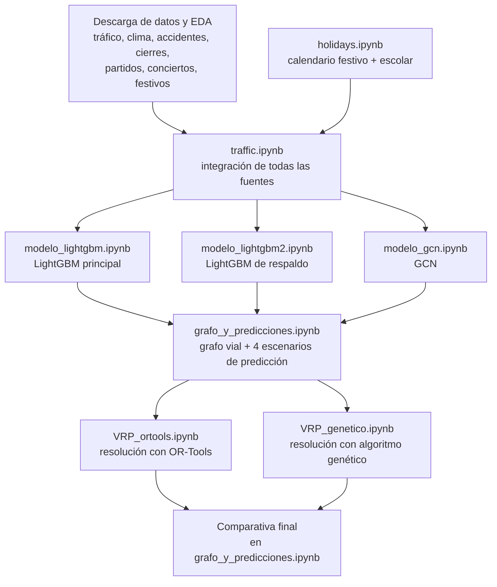

# Optimización de rutas de reparto en logística urbana

Este Trabajo de Fin de Máster de Ciencia de Datos en la Universidad de Alicante se centra en el diseño e implementación de un sistema que combina la **predicción de tráfico** con **optimización de rutas de reparto (VRP)**, aplicado a la ciudad de Chicago.

El sistema integra siete fuentes de datos abiertos (tráfico histórico, accidentes, cierres de calle, partidos, conciertos, calendario festivo y meteorología), entrena y compara tres modelos predictivos de tráfico (LightGBM, un modelo generalizable y una red neuronal de grafos), y resuelve un problema de rutas de vehículos sobre un grafo real de la red viaria, comparando un solver industrial (Google OR-Tools) con un algoritmo genético. Además, el sistema se valida tanto con datos históricos como con datos obtenidos en tiempo real de las fuentes originales.

---

## Índice

- [Arquitectura del pipeline](#arquitectura-del-pipeline)
- [Estructura del repositorio](#estructura-del-repositorio)
- [Resultados principales](#resultados-principales)
- [Tecnologías empleadas](#tecnologías-empleadas)
- [Cómo reproducir el proyecto](#cómo-reproducir-el-proyecto)
- [Fuentes de datos](#fuentes-de-datos)
- [Limitaciones conocidas](#limitaciones-conocidas)
- [Autoría](#autoría)

---

## Arquitectura del pipeline

El trabajo se organiza en seis fases. Cada notebook depende de los artefactos (parquet, modelos entrenados, checkpoints) generados por los anteriores, guardados en una carpeta compartida.



---

## Estructura del repositorio

```
.
├── data/
│   ├── ChicagoBears/    # Calendario de partidos 2015-2026 (Sports-Reference.com)
│   ├── ChicagoBlackhawks/
│   ├── ChicagoBulls/
│   ├── ChicagoCubs/
│   ├── ChicagoFire/
│   ├── ChicagoWhiteSox/
│   ├── Traffic_Crashes_-_Crashes_20260801.csv    # Chicago Data Portal
│   ├── Transportation_Department_Permits_-_Street_Closures_20260801.csv
│   └── vacation_days.csv
│
├── desc_y_EDA_concerts.ipynb    # Descarga (setlist.fm) y EDA de conciertos
├── desc_y_EDA_matches.ipynb     # Unificación y EDA de partidos de todos los equipos
├── descargar_traffic.py         # Descarga de tráfico histórico (Chicago Data Portal)
├── descargar_traffic2.py
├── descargar_weather.ipynb      # Descarga de clima histórico (Open-Meteo)
├── EDA_closures.ipynb           # Análisis exploratorio de cierres
├── EDA_crashes.ipynb            # Análisis exploratorio de accidentes
├── EDA_general.py               # Funciones generales de EDA
├── holidays.ipynb               # Calendario de festivos + vacaciones escolares
├── traffic.ipynb                # Integración de todas las fuentes en el dataset final
├── modelo_lightgbm.ipynb        # Modelo principal (LightGBM, segmentos monitorizados)
├── modelo_lightgbm2.ipynb       # Modelo de respaldo (LightGBM, generalizable)
├── modelo_gcn.ipynb             # Modelo GCN (PyTorch Geometric)
├── grafo_y_predicciones.ipynb   # Grafo vial (OSMnx) + 4 escenarios de predicción + comparativa final
├── VRP_ortools.ipynb            # Resolución del VRP con Google OR-Tools
├── VRP_genetico.ipynb            # Resolución del VRP con algoritmo genético
│
└── README.md
```

Los notebooks se ejecutaron en VSCode y Google Colab, guardando los artefactos intermedios (parquets, modelos `.txt`/`.pt`, checkpoints) en una carpeta común en la carpeta o en Google Drive llamada `data_clean`.

---

## Resultados principales

### Modelos de predicción de tráfico

| Modelo | MAE (km/h) | Información empleada |
|---|---|---|
| LightGBM principal | 1,85 | `segment_id` + velocidad de la hora anterior + contexto |
| GCN | 2,58 | vecinos en el grafo + velocidad de la hora anterior + contexto |
| LightGBM de respaldo | 3,55 | tipo de vía + contexto (generaliza a toda la red) |

### Optimización de rutas (4 escenarios × 2 métodos, 25 entregas / 4 vehículos)

| Escenario | Método | Makespan (min) | Tiempo total (min) |
|---|---|---|---|
| Histórico + LightGBM | OR-Tools | 141,9 | 548,3 |
| Histórico + LightGBM | Genético | 158,6 | 626,2 |
| Histórico + GCN | OR-Tools | 143,4 | 561,1 |
| Histórico + GCN | Genético | 154,6 | 605,0 |
| En vivo + LightGBM | OR-Tools | 139,1 | 548,9 |
| En vivo + LightGBM | Genético | 154,5 | 596,2 |
| En vivo + GCN | OR-Tools | 151,7 | 599,8 |
| En vivo + GCN | Genético | 163,5 | 649,2 |

---

## Tecnologías empleadas

| Categoría | Herramientas |
|---|---|
| Obtención de datos | API SODA2 (Chicago Data Portal), API setlist.fm, API Discovery (Ticketmaster), API Open-Meteo |
| Procesamiento a gran escala | DuckDB, pandas |
| Modelado predictivo (gradient boosting) | LightGBM |
| Modelado predictivo (deep learning) | PyTorch, PyTorch Geometric |
| Grafo vial y geoprocesamiento | OpenStreetMap, OSMnx, NetworkX, GeoPandas, Shapely, pyproj |
| Optimización de rutas | Google OR-Tools, algoritmo genético |
| Entorno de ejecución | Google Colab (GPU), Visual Studio Code |


## Fuentes de datos

- [Chicago Traffic Tracker – Historical Congestion Estimates by Segment](https://data.cityofchicago.org/Transportation/Chicago-Traffic-Tracker-Congestion-Estimates-by-Se/n4j6-wkkf/about_data) — tráfico histórico y en tiempo real
- [Traffic Crashes – Crashes](https://data.cityofchicago.org/Transportation/Traffic-Crashes-Crashes/85ca-t3if/about_data) — accidentes de tráfico
- [Transportation Department Permits – Street Closures](https://data.cityofchicago.org/Transportation/Transportation-Department-Permits-Street-Closures/jdis-5sry/about_data) — obras y cortes de vía
- [setlist.fm](https://www.setlist.fm/) — histórico de conciertos
- [Ticketmaster Discovery API](https://developer.ticketmaster.com/) — eventos deportivos y musicales en tiempo real
- [Pro Football Reference / Sports Reference](https://www.sports-reference.com/) — calendarios de partidos
- [Open-Meteo](https://open-meteo.com/) — variables meteorológicas históricas y actuales
- [OpenStreetMap](https://www.openstreetmap.org/) (vía OSMnx) — grafo de la red viaria

---

## Limitaciones conocidas

- El *feed* de tráfico en tiempo real de Chicago (`current`) no se actualiza con la frecuencia que indica su documentación oficial (se comprobó una desactualización de más de 100 días en el momento de la validación).
- La API de setlist.fm es retrospectiva (no permite saber si un concierto está ocurriendo ahora mismo); para el escenario en tiempo real se sustituyó por Ticketmaster.
- El modelo GCN es transductivo: no generaliza a segmentos fuera del grafo de entrenamiento, por lo que sigue siendo necesario el modelo de respaldo para el resto de la red viaria.

Más detalle sobre estas y otras limitaciones en el capítulo de Conclusiones de la memoria.

---

## Autoría

Trabajo de Fin de Máster — *Itsaso Ariztimuño Cenoz, máster en Ciencia de Datos, universidad de Alicante*

Tutor/a: *Miguel Ángel Teruel*
