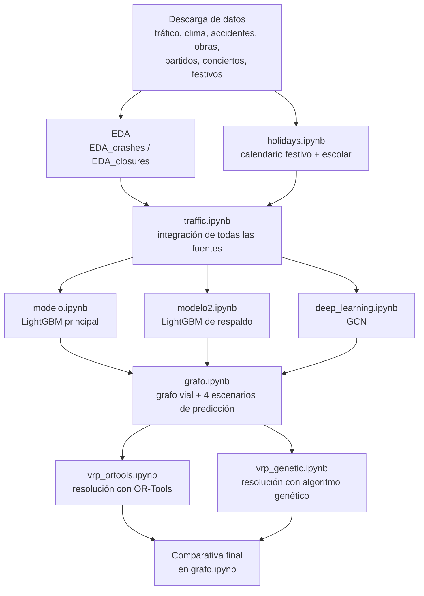

# Optimización de rutas de reparto en logística urbana mediante predicción de tráfico

Trabajo de Fin de Máster centrado en el diseño e implementación de un sistema integral que combina **predicción de tráfico mediante aprendizaje automático** con **optimización de rutas de reparto (VRP)**, aplicado a la ciudad de Chicago.

El sistema integra siete fuentes de datos abiertos (tráfico histórico, accidentes, obras, eventos deportivos, conciertos, calendario festivo y meteorología), entrena y compara tres modelos predictivos de tráfico (LightGBM, un modelo generalizable y una red neuronal de grafos), y resuelve un problema de rutas de vehículos sobre un grafo real de la red viaria, comparando un solver industrial (Google OR-Tools) con un algoritmo genético implementado específicamente para este trabajo. El sistema se valida tanto con datos históricos como con datos obtenidos en tiempo real de las fuentes originales.

📄 La memoria completa del trabajo está disponible en [`/memoria`](./memoria) *(enlace a completar)*.

---

## Índice

- [Arquitectura del pipeline](#arquitectura-del-pipeline)
- [Estructura del repositorio](#estructura-del-repositorio)
- [Resultados principales](#resultados-principales)
- [Tecnologías empleadas](#tecnologías-empleadas)
- [Cómo reproducir el proyecto](#cómo-reproducir-el-proyecto)
- [Fuentes de datos](#fuentes-de-datos)
- [Limitaciones conocidas](#limitaciones-conocidas)
- [Autoría](#autoría)

---

## Arquitectura del pipeline

El proyecto se organiza en cinco fases secuenciales. Cada notebook depende de los artefactos (parquet, modelos entrenados, checkpoints) generados por los anteriores, guardados en una carpeta compartida de Google Drive.



Los notebooks de resolución del VRP (`vrp_ortools.ipynb`, `vrp_genetic.ipynb`) son intencionadamente ligeros: no dependen de OSMnx, LightGBM ni PyTorch, únicamente de las matrices de tiempo generadas por `grafo.ipynb`, lo que permite ejecutarlos y compararlos de forma independiente.

---

## Estructura del repositorio

```
.
├── data/
│   ├── ChicagoBears/                                              # Calendario de partidos, 2015-2026
│   ├── ChicagoBlackhawks/
│   ├── ChicagoBulls/
│   ├── ChicagoCubs/
│   ├── ChicagoFire/
│   ├── ChicagoWhiteSox/
│   ├── Traffic_Crashes_-_Crashes_20260801.csv                     # Chicago Data Portal
│   ├── Transportation_Department_Permits_-_Street_Closures_20260801.csv
│   └── vacation_days.csv
│
├── desc_y_EDA_concerts.ipynb        # Descarga (setlist.fm) y EDA de conciertos
├── desc_y_EDA_matches.ipynb         # Unificación y EDA de partidos de todos los equipos
├── descargar_traffic.py             # Descarga masiva del tráfico histórico (Chicago Data Portal)
├── descargar_traffic2.py
├── descargar_weather.ipynb          # Descarga de clima histórico (Open-Meteo)
├── EDA_crashes.ipynb                # Análisis exploratorio de accidentes
├── EDA_closures.ipynb               # Análisis exploratorio de obras/cierres
├── holidays.ipynb                   # Calendario de festivos + vacaciones escolares
│
├── traffic.ipynb                    # Integración de todas las fuentes en el dataset final
│
├── modelo.ipynb                     # Modelo principal (LightGBM, segmentos monitorizados)
├── modelo2.ipynb                    # Modelo de respaldo (LightGBM, generalizable)
├── deep_learning.ipynb              # Modelo GCN (PyTorch Geometric)
│
├── grafo.ipynb                      # Grafo vial (OSMnx) + 4 escenarios de predicción + comparativa final
├── vrp_ortools.ipynb                # Resolución del VRP con Google OR-Tools
├── vrp_genetic.ipynb                # Resolución del VRP con algoritmo genético propio
│
└── README.md
```

> Los notebooks se ejecutaron en Google Colab, guardando los artefactos intermedios (parquets, modelos `.txt`/`.pt`, checkpoints) en una carpeta común de Google Drive referenciada como `data_clean` en el código. Para reproducir el proyecto es necesario ajustar esta ruta a tu propio entorno (véase [Cómo reproducir el proyecto](#cómo-reproducir-el-proyecto)).

---

## Resultados principales

### Modelos de predicción de tráfico

| Modelo | MAE (km/h) | Información empleada |
|---|---|---|
| LightGBM principal | 1,85 | `segment_id` + velocidad de la hora anterior + contexto |
| GCN | 2,57 | vecinos en el grafo + velocidad de la hora anterior + contexto |
| LightGBM de respaldo | 3,54 | tipo de vía + contexto (generaliza a toda la red) |

### Optimización de rutas (4 escenarios × 2 métodos, 25 entregas / 4 vehículos)

| Escenario | Método | Makespan (min) | Tiempo total (min) |
|---|---|---|---|
| Histórico + LightGBM | OR-Tools | 141,9 | 548,3 |
| Histórico + LightGBM | Genético | 158,6 | 626,2 |
| Histórico + GCN | OR-Tools | 143,4 | 561,1 |
| Histórico + GCN | Genético | 154,6 | 605,0 |
| En vivo + LightGBM | OR-Tools | 139,1 | 548,9 |
| En vivo + LightGBM | Genético | 154,5 | 596,2 |
| En vivo + GCN | OR-Tools | 151,7 | 599,8 |
| En vivo + GCN | Genético | 163,5 | 649,2 |

Detalles, gráficos e interpretación completa de estos resultados en la memoria del trabajo.

---

## Tecnologías empleadas

| Categoría | Herramientas |
|---|---|
| Obtención de datos | API SODA2 (Chicago Data Portal), API setlist.fm, API Discovery (Ticketmaster), API Open-Meteo |
| Procesamiento a gran escala | DuckDB, pandas |
| Modelado predictivo (gradient boosting) | LightGBM |
| Modelado predictivo (deep learning) | PyTorch, PyTorch Geometric |
| Grafo vial y geoprocesamiento | OpenStreetMap, OSMnx, NetworkX, GeoPandas, Shapely, pyproj |
| Optimización de rutas | Google OR-Tools, algoritmo genético (implementación propia) |
| Entorno de ejecución | Google Colab (GPU), Visual Studio Code |

---

## Cómo reproducir el proyecto

1. **Clona el repositorio** y súbelo (o móntalo) en tu entorno de Google Colab / Drive.

2. **Instala las dependencias** (cada notebook instala las suyas propias en su primera celda, por ejemplo):
   ```bash
   pip install duckdb lightgbm osmnx ortools torch_geometric geopandas
   ```

3. **Configura tus propias claves de API**, necesarias para los notebooks de descarga y para el escenario en tiempo real:
   - [Chicago Data Portal](https://data.cityofchicago.org/) (App Token, opcional pero recomendado)
   - [setlist.fm API](https://api.setlist.fm/docs/1.0/index.html)
   - [Ticketmaster Discovery API](https://developer.ticketmaster.com/)
   - [Open-Meteo](https://open-meteo.com/) (no requiere clave)

4. **Ajusta la ruta base** (`data_clean`) al principio de cada notebook a tu propia carpeta de Google Drive.

5. **Ejecuta los notebooks en el orden indicado** en el [diagrama de arquitectura](#arquitectura-del-pipeline). Ten en cuenta que:
   - La descarga inicial de tráfico histórico (`descargar_traffic.py`/`2.py`) puede tardar varias horas por el volumen de datos.
   - El entrenamiento de la GCN (`deep_learning.ipynb`) requiere GPU para un tiempo de entrenamiento razonable.
   - `grafo.ipynb` debe ejecutarse hasta el apartado de guardado de escenarios antes de lanzar `vrp_ortools.ipynb` y `vrp_genetic.ipynb`; su comparativa final se ejecuta después, una vez generados los resultados de ambos.

---

## Fuentes de datos

- [Chicago Traffic Tracker – Historical Congestion Estimates by Segment](https://data.cityofchicago.org/) — tráfico histórico y en tiempo real
- [Traffic Crashes – Crashes](https://data.cityofchicago.org/) — accidentes de tráfico
- [Transportation Department Permits – Street Closures](https://data.cityofchicago.org/) — obras y cortes de vía
- [setlist.fm](https://www.setlist.fm/) — histórico de conciertos
- [Ticketmaster Discovery API](https://developer.ticketmaster.com/) — eventos deportivos y musicales en tiempo real
- [Pro Football Reference / Sports Reference](https://www.sports-reference.com/) — calendarios de partidos de los equipos de Chicago
- [Open-Meteo](https://open-meteo.com/) — variables meteorológicas históricas y actuales
- [OpenStreetMap](https://www.openstreetmap.org/) (vía OSMnx) — grafo de la red viaria

---

## Limitaciones conocidas

- El *feed* de tráfico en tiempo real de Chicago (`current`) no se actualiza con la frecuencia que indica su documentación oficial (se comprobó una desactualización de más de 100 días en el momento de la validación).
- La API de setlist.fm es retrospectiva (no permite saber si un concierto está ocurriendo ahora mismo); para el escenario en tiempo real se sustituyó por Ticketmaster.
- El modelo GCN es transductivo: no generaliza a segmentos fuera del grafo de entrenamiento, por lo que sigue siendo necesario el modelo de respaldo para el resto de la red viaria.

Más detalle sobre estas y otras limitaciones en el capítulo de Conclusiones de la memoria.

---

## Autoría

Trabajo de Fin de Máster — *(nombre, máster y universidad a completar)*
Tutor/a: *(nombre a completar)*

Para cualquier duda sobre el código, abre un [issue](../../issues) en este repositorio.
